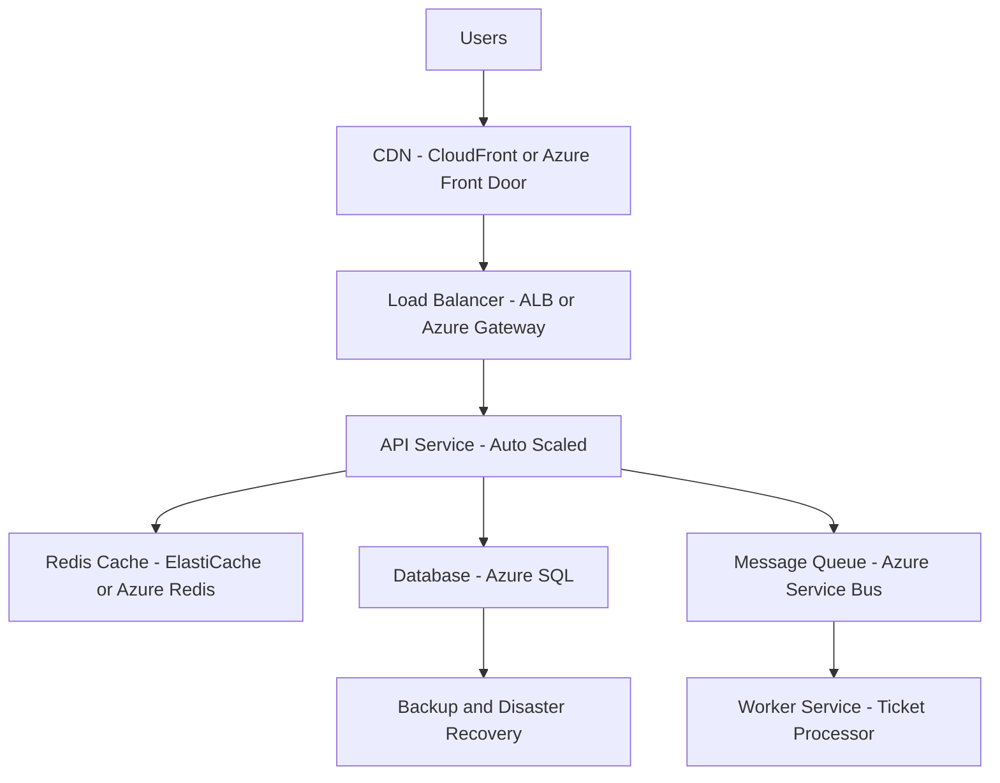

# 🎟️ Ticketing System Design with Redis Caching

This document outlines a scalable, fault-tolerant design for a **ticketing system** used by a high-traffic Leap event platform, with a focus on **cloud-native infrastructure** and an effective **Redis caching strategy**.

---

## 🌐 System Design Overview

The Leap ticketing system must support:

- High concurrency (thousands of users purchasing tickets)
- Real-time ticket availability
- Scalability and fault tolerance
- Data consistency during critical operations like checkout

I propose a **microservices-based architecture** deployed on a **Cloud platform (e.g., Azure or AWS)** with Redis as a central caching layer.

---

## 📐 High-Level Architecture



## ☁️ Cloud Services Used


| Component      | AWS Example                | Azure Example                  | Purpose                                 |
| -------------- | -------------------------- | ------------------------------ | --------------------------------------- |
| CDN            | CloudFront                 | Azure Front Door               | Deliver static content with low latency |
| Load Balancer  | Application Load Balancer  | Azure Application Gateway      | Distribute user traffic to services     |
| API Service    | EC2 / ECS / Lambda         | Azure App Service / Functions  | Host backend APIs, scalable compute     |
| Redis Cache    | ElastiCache for Redis      | Azure Redis Cache              | Fast access to hot data and locks       |
| Database       | Amazon RDS + Read Replicas | Azure SQL Database             | Persistent, transactional storage       |
| Message Queue  | SQS                        | Azure Service Bus              | Handle async background processing      |
| Worker Service | Fargate / Lambda           | Azure Container App / Function | Ticket processing, DB updates           |
| Backup         | RDS Snapshots              | Azure Backup / Geo-redundancy  | Disaster recovery and failover          |


## ⚡ Redis Caching Strategy

### ✅ What to Cache


| Data Type        | Strategy      | TTL           | Notes                                |
| ---------------- | ------------- | ------------- | ------------------------------------ |
| Event Listings   | Cache-aside   | 5–10 minutes  | Frequently accessed, rarely modified |
| Ticket Inventory | Write-through | Real-time     | Updated via Lua script for atomicity |
| Pricing & Offers | Cache-aside   | 10–30 minutes | Reduce recomputation                 |
| User Sessions    | Write-through | Session TTL   | Fast access to auth/session context  |
| Venue Metadata   | Cache-aside   | 1 hour        | Shared across many users             |


## 🔁 Caching Patterns Used

### 🧠 Cache-aside

- The application checks Redis first.
- If the data is **not present**, it **loads from the database**, then stores it in the cache.
- 🔹 **Use Case**: Ideal for **infrequently changing data** like event listings and ticket pricing.

### ✍️ Write-through
- Data is written **to both Redis and the database simultaneously**.
- 🔹 **Use Case**: Best for **real-time features** and **user sessions** where data must always be in sync.

### 🧩 Redis Lua Scripts (Atomic Operations)
Used to **prevent overselling** of tickets during high concurrency.

```lua
-- Atomic Ticket Reservation Example
local key = KEYS[1]
local available = tonumber(redis.call("GET", key))
if available and available > 0 then
    redis.call("DECR", key)
    return 1
else
    return 0
end
```


## 🔐 Concurrency Control for Ticketing

To **prevent race conditions** and **ticket overselling**, the following flow is implemented:

1. The **API checks inventory** from **Redis**.
2. Redis executes an **atomic Lua script** to reserve the ticket.

### If reservation is **successful**:
- A **message is published** to a **message queue**.
- A **worker service processes the payment** and updates the database.

### If reservation **fails**:
- Inventory is **not decremented**.
- The **user is notified** about unavailability.

---

✅ **This pattern ensures**:
- ⚙️ **Atomicity** of ticket reservations  
- 🚀 **High performance** under load  
- ☁️ **Scalability** with cloud-native infrastructure


## 🛡️ Fault Tolerance & Reliability

| **Failure Scenario**      | **Mitigation Strategy**                                          |
|---------------------------|------------------------------------------------------------------|
| Redis failure             | Fallback to DB with retry & monitoring alerts                    |
| Data inconsistency        | Use TTL and refresh stale data on read                           |
| Overselling               | Redis locking with Lua or Redlock pattern                        |
| Message loss in queue     | DLQ (Dead Letter Queue) and retry policies                        |
| Region or AZ failure      | Multi-region deployment and replication                           |


## 📈 Benefits of Redis in this System

- ⚡ **Ultra-fast reads** for hot data like ticket inventory  
- 🔁 **Reduces DB load** by caching non-transactional reads  
- 🔒 **Atomic locking** for ticket reservations  
- 🔄 **TTL & eviction policies** keep memory usage optimal  
- 🔊 **Pub/Sub support** for invalidation or notification  

